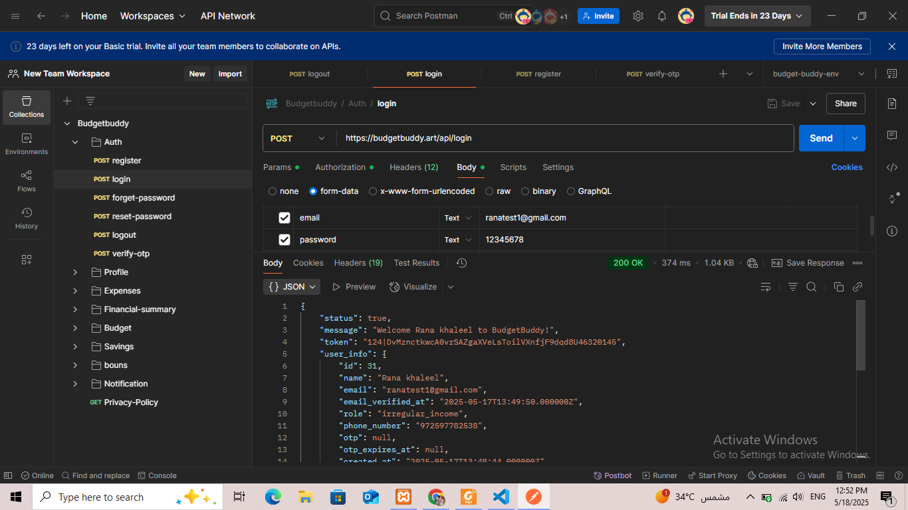
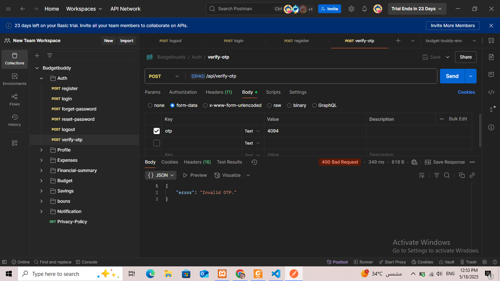

# BudgetBuddy API

BudgetBuddy is a Laravel-based backend API that helps users manage their personal budgets and expenses efficiently.

## 🚀 Features

- User Registration & Login (Laravel Sanctum)
- verify account via email
- reset password and verify otp via email
- Set Monthly Salary and Monitor Usage
- Add, Edit, and Delete Expenses
- Notifications when 80% of budget is reached
- Set budget precentage and show net balance.
- Bonus  preference for fixed income users
- Add and edit jobs
- add, show, and delete goals
- Show profile 
- Salary Collection Reminder
- Emergency fund alert for irregular income - recommendation for saving money
- financial reports 
- contact us via email mariam@budgetbuddy.art 
- RESTful API with clean structure
- Real-time expense tracking

## 🛠️ Tech Stack

- PHP 8.2.12 / Laravel 11
- MySQL
- Laravel Sanctum (for auth)
- Flutter frontend (not included here)

## 📦 Installation

1. Clone the repository
2. Run `composer install`
3. Copy `.env.example` to `.env` and set your environment variables
4. Be aware of your config/chache.php + config/database.php settings
5. Run migrations: `php artisan migrate`
6. Serve the app: `php artisan serve`

## 📬 API Endpoints (Examples)

| Method | Endpoint                         | Description                         |
|--------|----------------------------------|-------------------------------------|
| POST   | /api/register                    | Register a new user                 |
| POST   | /api/login                       | Login and get access token          |
| POST   | /api/verify-otp                  | Verfiy account get otp via email    |
| POST   | /api/logout                      | Exist session                       |
| POST   | /api/forgot-password             | Reset password when user forgets it |
| GET    | /api/profile/{user}              | Show user profile                   |
| POST   | /api/fixed-jobs                  | Add fixed user job details          |
| POST   | /api/irregular-jobs              | Add irregular user job details      |
| POST   | /api/update-fixed-jobs/{id}      | Update fixed user job details       |
| POST   | /api/update-irregular-jobs/{id}  | Update irregular user job details   |
| GET    | /api/account/balance             |                    |
| POST   | /api/set-budget                  |                    |

 
## 📷 Screenshots

_(You can add Postman screenshots or JSON samples here)_

## 📎 Postman Collection

You can import and test the API using [this collection](#) _(add your link if available)_

## 👩‍💻 Author

Mariam Kamal Al-Ashqar  
E-mail: maryamkashqar@gmail.com
Backend Developer | Laravel  

---

## 📄 License

MIT License
