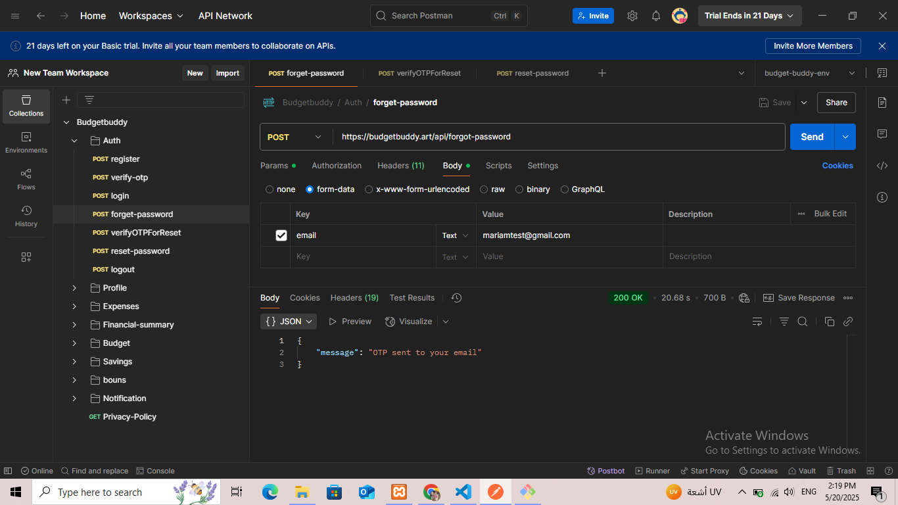
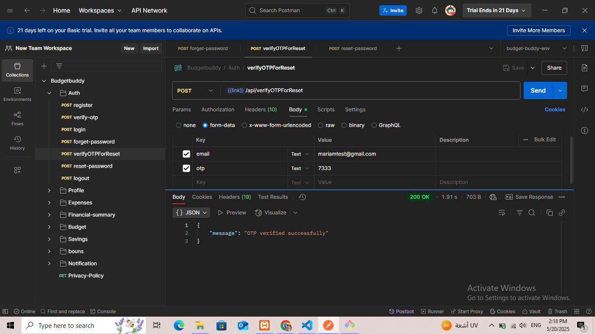
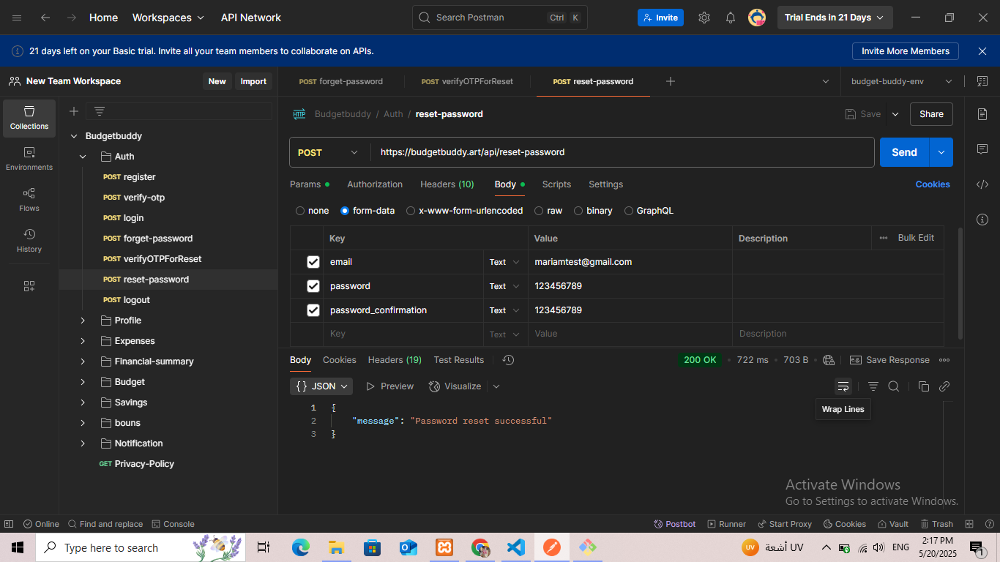
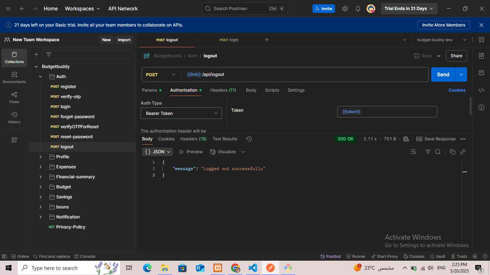

# BudgetBuddy API

BudgetBuddy is a Laravel-based backend API that helps users manage their personal budgets and expenses efficiently.

## 🚀 Features

- User Registration & Login (Laravel Sanctum)
- verify account via email
- reset password and verify otp via email
- Set Monthly Salary and Monitor Usage
- Add, Edit, and Delete Expenses
- Notifications when 80% of budget is reached
- Set budget precentage and show net balance.
- Bonus  preference for fixed income users
- Add and edit jobs
- add, show, and delete goals
- Show profile 
- Salary Collection Reminder
- Emergency fund alert for irregular income - recommendation for saving money
- financial reports 
- contact us via email mariam@budgetbuddy.art 
- RESTful API with clean structure
- Real-time expense tracking

## 🛠️ Tech Stack

- PHP 8.2.12 / Laravel 11
- MySQL
- Laravel Sanctum (for auth)
- Flutter frontend (not included here)

## 📦 Installation

1. Clone the repository
2. Run `composer install`
3. Copy `.env.example` to `.env` and set your environment variables
4. Be aware of your config/chache.php + config/database.php settings
5. Run migrations: `php artisan migrate`
6. Serve the app: `php artisan serve`

## 📬 API Endpoints (Examples)

| Method | Endpoint                         | Description                                           |
|--------|----------------------------------|-------------------------------------------------------|
| POST   | /api/register                    | Register a new user                                   |
| POST   | /api/login                       | Login and get access token                            |
| POST   | /api/verify                      | Verfiy account get otp via email                      |
| POST   | /api/logout                      | Exist session                                         |
| POST   | /api/forgot-password             | Reset password when user forgets it                   |
| POST   | /api/verifyOTPForReset           |  verify otp to resetet password                       |
| POST   | /api/reset-password              | Reset new password                                    |
| GET    | /api/profile/{user}              | Show user profile                                     |
| POST   | /api/fixed-jobs                  | Add fixed user job details                            |
| POST   | /api/irregular-jobs              | Add irregular user job details                        |
| POST   | /api/update-fixed-jobs/{id}      | Update fixed user job details                         |
| POST   | /api/update-irregular-jobs/{id}  | Update irregular user job details                     |
| GET    | /api/account/balance             | To get net balnce of the income and epenses           |
| POST   | /api/set-budget                  | Set budget amount for each expenses category          |
| GET    | /api/emergency-fund              | A suggestion saving message for iregular income users |
| POST   | /api/expenses                    | Add expense details                                   |
| GET    | /api/expenses/{category}         | Show each expenses category                           |
| DELETE | /api/expenses/{expenseId}        | Delete expense                                        |
| PUT    | /api/expenses/{id}               | Update/Edit expense details                           |
| POST   | /api/add-goal                    | Add saving goal                                       |
| GET    | /api/get-goals                   | Show saving goals                                     |
| PUT    | /api/update-goal/{id}            | Update/Edit saving goal details                       |
| DELETE | /api/goal/{id}                   | Delete saving goal                                    |
| GET    | /api/bar-chart                   | Show financial report for expenses via last 6months   |
| GET    | /api/pie-chart                   | Show precentage of the expenses amount category       |
| POST   | /api/set-bonus-preference        | Set true if you recive bouns(for fixed income users)  |
| POST   | /api/bonuses                     | Add bounse amount and date                            |
| GET    | /api/bonuses                     |                   |

## 📷 Screenshots

_(You can add Postman screenshots or JSON samples here)_

## 📎 Postman Collection

You can import and test the API using [https://cloudy-shadow-252395.postman.co/workspace/New-Team-Workspace~28c3c01f-7642-4b72-bb9a-79372ce7306b/collection/28405749-606f52d1-e29f-4c84-bacf-28c878efe12e?action=share&creator=28405749&active-environment=28844777-128d7a8f-6974-4f2e-9e2c-1d6f858acfe5]

## 👩‍💻 Author

Mariam Kamal Al-Ashqar  
E-mail: maryamkashqar@gmail.com
Backend Developer | Laravel  

---

## 📄 License

MIT License
